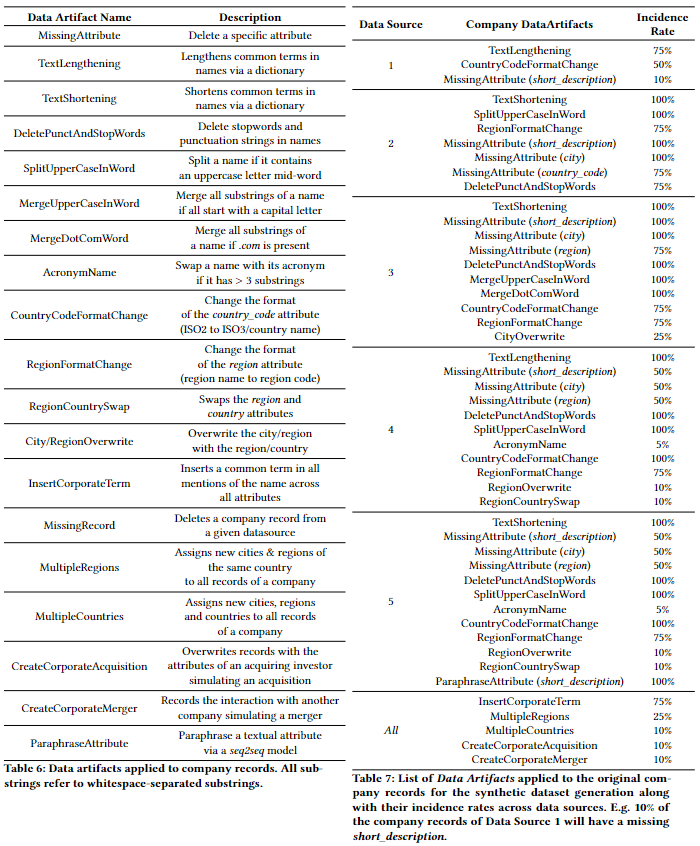
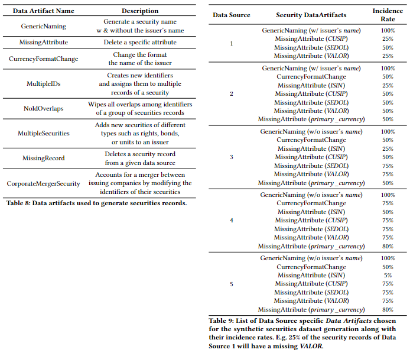

# GraLMatch: Matching Groups of Entities with  <u>Gra</u>phs and <u>L</u>anguage <u>M</u>odels


## Setup Your Environment

This readme assumes, you are running Python version `3.8.10`- though other recent versions of Python should work as well.


### Local Env
Use the following code snippets to set up your local environment:

```
python3 -m venv env
source env/bin/activate
pip install -r requirements.txt
```

On Ubuntu, it might be necessary to install the dev version of Python, i.e. `sudo apt-get install python3-dev`.

## Start Running Code

Activate the installed Python environment either by running `source env/bin/activate` or executing the `activate_env.sh` shell script. If you plan on running Jupyter Notebooks, you can start them by using the `start_jupyter.sh` script.


## WANDB

We log the progress of the model training into WANDB, to do this on your end change the project name `PLEASE_REPLACE_ME_WITH_YOUR_WANDB_PROJECT_NAME` and entity name `PLEASE_REPLACE_ME_WITH_YOUR_WANDB_ENTITY` in `datainc_code/src/helpers/wandb_helper.py` here:

```python
def initialize_wandb(args, job_type='train'):
    wandb.init(
        project="PLEASE_REPLACE_ME_WITH_YOUR_WANDB_PROJECT_NAME",
        entity="PLEASE_REPLACE_ME_WITH_YOUR_WANDB_ENTITY",
    ...
```

## Experiments
Every run is run three times with different model_seeds
### Securities
#### training distillbert-all
**run 1**
```bash
python3 src/models/run_transformer_training.py 
  --dataset_name synthetic_securities 
  --model_seed 27 
  --use_validation_set 
  --save_model 
  --save_config 
  --wandb
```
**run 2**
```bash
python3 src/models/run_transformer_training.py 
  --dataset_name synthetic_securities 
  --model_seed 2 
  --use_validation_set 
  --save_model 
  --save_config 
  --wandb
```
**run 3**
```bash
python3 src/models/run_transformer_training.py 
  --dataset_name synthetic_securities 
  --model_seed 44 
  --use_validation_set 
  --save_model 
  --save_config 
  --wandb
```

#### full matching

After training those models, the full matching needs to be run:


```bash
python3 scripts/run_full_matching.py 
  --experiment_name <experiment_name> 
  --epoch <epoch> 
  --matcher synthetic_securities 
  --company_matching <company_matching>
```

The `<experiment_name>` is the folder created under `models/` for the corresponding training run (e.g. `2024-01-25_140728__securities`), 
`<epoch>` is the epoch you chose to be the best, after training, and the `<company_matching>` indicates which company matching (indicated by the `<experiment_name>` used when running the company matching) should be used for the "Issuer Match" blocking for securities. If the matching is for companies, the `<company_matching>` can be left blank.

After the full matching has been performed for one or n runs, the scores can be obtained using the following call:

```bash
python3 scripts/get_scores_matching.py 
  --dataset_name synthetic_securities 
  --experiment_names_list <experiment_name_1>
  --experiment_names_list <experiment_name_n>
  --ground_truth data/processed/synthetic_securities/seed_44/test__pre_split__given_matches.csv
```

### Synthetic Dataset Generation 

In order to generate the synthetic datasets, place the source files (`organizations.csv` and `countries_states_cities.json`, downloadable from: https://drive.google.com/drive/folders/1KARFq_wKdmjL8d3JNElOiOkAu6O5Z7qY?usp=drive_link) in `data/raw/`, such that you have e.g. `data/raw/synthetic_data`. Alternatively, `organizations.csv` can be downloaded directly from Crunchbase (https://data.crunchbase.com/docs/crunchbase-basic-export) and `countries_states_cities.json` from Github (https://github.com/dr5hn/countries-states-cities-database/blob/master/countries%2Bstates%2Bcities.json).

The generation is carried out via the following script:

```
 scripts/synthetic_data/create_synthetic_companies_and_securities_dataset.py
```
Data Artifact parameters can be modified to generate new datasets with different proportions of matching challenges. To do so, modify the dict values in the `generate_companies_dataset` function in:
```
src/data/synthetic_data_generation/synthetic_companies_generator.py
```
and equivalently with the `generate_securities_dataset` function in:
```
src/data/synthetic_data_generation/synthetic_securities_generator.py
```
The following Tables describe each of the Data Artifacts along with the parameters used to generate the synthetic dataset in the paper: 

Companies             |  Securities
:-------------------------:|:-------------------------:
  |  

Note that multiple Data Artifacts are sequentially applied to records and thus their effects are intertwined.